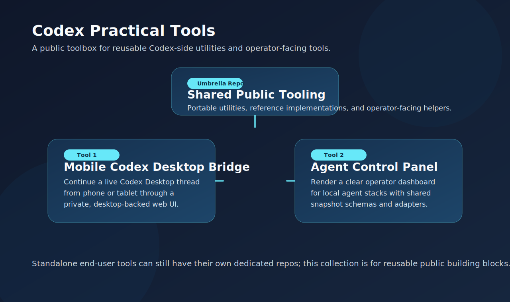

# Codex Practical Tools

Reusable Codex utilities and operator-facing tools that are useful outside any
single project repo.

This repository is the public toolbox layer of the account. It is meant for
portable utilities, reference implementations, and small operator products that
can stand on their own.

## What lives here

This repo currently carries two public tools:

### 1. Mobile Codex Desktop Bridge

Path:

- `tools/mobile-codex-desktop-bridge/`

What it provides:

- phone-friendly access to the current Codex Desktop thread
- desktop-backed `New Session` and `Add project` sync
- authenticated local-file proxying for files returned by Codex
- a private-by-default remote access workflow for personal use

Reference design notes:

- [docs/CODEX_DESKTOP_BRIDGE.md](docs/CODEX_DESKTOP_BRIDGE.md)

If you only need this tool as a standalone project, use the dedicated repo:

- [mobileCodexHelper](https://github.com/miyahluvgames-source/mobileCodexHelper)

### 2. Agent Control Panel

Path:

- `tools/agent-control-panel/`

What it provides:

- a polished static dashboard for local agent stacks
- a shared snapshot schema instead of a hard-wired machine dump
- a Codex adapter for snapshot generation
- a Claude Code-friendly adapter for config-driven rendering

Preview:

Reference design notes:

- [docs/AGENT_CONTROL_PANEL.md](docs/AGENT_CONTROL_PANEL.md)

## Repo role

Use this repo when you want:

- a curated collection of reusable Codex-side utilities
- reference implementations that may later become standalone tools
- small public tools that benefit from living together under one toolbox

Do not use this repo as a dump for machine-local stack snapshots, private
operator notes, or environment-specific handoff material.

## Layout

- `tools/`
  - reusable public tools and reference implementations
- `docs/`
  - repo-level design notes for the tools in this collection

## Design rule

If the requirement is "continue the same Codex Desktop conversation", do not
replace that with a separate SDK session. The visible desktop thread remains
the execution authority, and remote surfaces should behave like projections of
that thread rather than independent clients.
