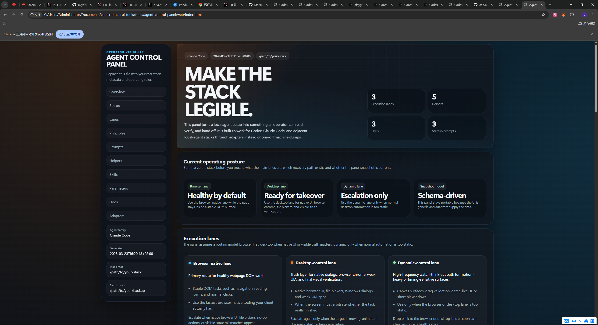

# Agent Control Panel

This tool turns an otherwise opaque local agent stack into a browser-openable
operator dashboard.

It is designed to be portable:

- the web UI is agent-agnostic
- the data model is a shared schema
- Codex and Claude Code differences live in adapters, not in the page itself

Use it when you need a readable control surface for:

- execution lanes
- routing rules and rescue ladders
- startup prompts
- helper inventory
- installed skills
- configuration parameters
- source docs and adapter notes

## Preview



## Layout

- `web/`
  - static control panel UI
- `docs/SCHEMA.md`
  - shared snapshot schema
- `adapters/codex/`
  - snapshot builder for Codex-style local stacks
- `adapters/claude-code/`
  - config-driven snapshot builder for Claude Code or similar stacks

## Quick start

### 1. Open the bundled demo

Open:

- `tools/agent-control-panel/web/index.html`

That renders the included portable demo snapshot.

### 2. Generate a Codex snapshot

Run:

```powershell
python tools/agent-control-panel/adapters/codex/build_codex_snapshot.py `
  --stack-root "C:\path\to\your\stack" `
  --output-dir "C:\path\to\repo\tools\agent-control-panel\web"
```

That writes:

- `panel-data.json`
- `panel-data.js`

into the target `web/` directory.

### 3. Generate a Claude Code snapshot

Edit:

- `tools/agent-control-panel/adapters/claude-code/sample-config.json`

Then run:

```powershell
python tools/agent-control-panel/adapters/claude-code/build_claude_snapshot.py `
  --config "C:\path\to\sample-config.json" `
  --output-dir "C:\path\to\repo\tools\agent-control-panel\web"
```

## Design goals

- no backend required
- safe to publish as a generic tool
- readable by humans before they read source code
- easy to adapt to new agent stacks without redesigning the page

## What this tool is not

- not a live monitor
- not a remote execution bridge
- not a fourth execution lane

It is an operator-facing visibility layer.
